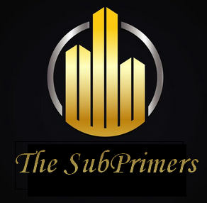

<!-- PROJECT SHIELDS -->
[](https://www.python.org/)
[](https://simplon.co/)


<!-- PROJECT LOGO -->
<br/>
<br/>
<br/>
<p align="center">
  <a href="">
    
  </a>

  <h3 align="center"><strong>Real estate - The SubPrimers Project</strong></h3>

  <p align="center">
    <strong>Crashing Prices !</strong>
    <br/>
    <a href="https://gist.github.com/louisdorard/88e09b8fdc4be81c27cde6e1b9bb9f61"><strong>Explore the instructions »</strong></a>
    <br />
    <br />
    <!-- <a href="#">View Demo</a> -->
  </p>
</p>


<!-- TABLE OF CONTENTS -->
## Table of Contents

- [Table of Contents](#table-of-contents)
- [The SubPrimers Project](#the-subprimers-project)
  - [Pourquoi ce projet ?](#pourquoi-ce-projet)
  - [Les technologies utilisées](#les-technologies-utilis%c3%a9es)
    - [Scrapping](#scrapping)
    - [Modèle](#mod%c3%a8le)
    - [API Web](#api-web)
    - [Services Cloud](#services-cloud)
- [Installer le projet](#installer-le-projet)
  - [Prérequis](#pr%c3%a9requis)
  - [Installation](#installation)
- [Pistes d'amélioration](#pistes-dam%c3%a9lioration)
- [The Team](#the-team)


<!-- ABOUT THE PROJECT -->
## The SubPrimers Project
[](https://github.com/Simplon-IA-Bdx-1/realestate-thesubprimers)


### Pourquoi ce projet ?

Le projet `Real-Estate` :house: a été réalisé dans le cadre de la formation de Développeur IA de l'école Microsoft/Simplon Bordeaux. <br/>
Le but est de réaliser un projet ML en end-to-end s'inspirant du challenge [*Kaggle House Prices*](https://www.kaggle.com/c/house-prices-advanced-regression-techniques) afin de pouvoir prédire le prix d'un bien immobilier.<br/>
Nous avons décidés de se baser sur la vente des maisons et des appartements de la région Ile-de-France.</br>
Pour cela nous avons réalisées les étapes suivantes :
* Faire du scrapping sur les sites d'immobilier (seloger.com)
* Traiter les données
* Créer un modèle et l'entrainer
* Mettre le modèle sous forme d'API avec une interface web
* Rendre l'API autonome (scrapper toutes les semaines, ré-entrainer le modèle)
* Migrer le tout sur Azure afin de le rendre accessible en ligne


### Les technologies utilisées

#### Scrapping
* [Beautiful Soup 4](https://www.crummy.com/software/BeautifulSoup/bs4/doc/)
* [Scrappy](https://scrapy.org/)
* [Selenium](https://selenium-python.readthedocs.io/)

#### Modèle
* [XGBoost](https://xgboost.readthedocs.io/en/latest/)
* [SKlearn](https://scikit-learn.org/)
* [Pandas](https://pandas.pydata.org/)
* [Numpy](https://numpy.org/)

#### API Web
* [Bootstrap](https://getbootstrap.com)
* [JQuery](https://jquery.com)
* [Flask](https://flask.palletsprojects.com/)

#### Services Cloud
* [Microsoft Azure](https://azure.microsoft.com/fr-fr/)


<!-- GETTING STARTED -->
## Installer le projet

Pour obtenir une copie locale et l'exécuter, suivez les étapes suivantes.

### Prérequis

[](https://www.python.org/)
[](https://www.anaconda.com/)
[](https://jupyter.org/)
</br><p>Et un IDE de votre choix</p>

### Installation

1. Cloner le repo en cliquant sur le bouton `Clone or Download` ou taper la commande suivante dans un terminal :
```sh
git clone https://github.com/Simplon-IA-Bdx-1/realestate-thesubprimers.git
```
2. Créer votre environnement de travail sous conda

3. Installer les librairies nécessaires dans cet environnement
```sh
pip install requirements.txt
```
4. Ouvrir une fenêtre de commande et entrer :
```sh
python app.py
```
5. Cliquer sur le lien qui s'affiche

6. Bonne navigation !

<!-- USAGE EXAMPLES -->
## Pistes d'amélioration

Ce projet est toujours en cours de réalisation.


<!-- CONTACT -->
## The Team

 <p>
    <a href="https://github.com/DaTikh">Baptiste</a>
    ·
    <a href="https://github.com/xNlyo">Thibaud</a>
    ·
    <a href="https://github.com/YohanCaillau">Yohan</a>
    ·
    <a href="https://github.com/rachelrwf">Rachel</a>
  </p>
